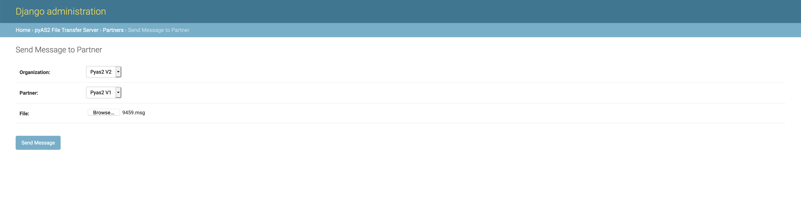

Send & Receive Messages
=======================
We have so far covered all the topics related to configuration of the ``pyAS2`` server. Now we will see how
to use these configurations to send messages to your trading partners using the AS2 protocol. We can send files
using any of the following techniques:

Send Messages From the Django Admin
-----------------------------------

The simplest method for sending messages to your trading partner is by using the Django Admin. This method is generally used
for testing the AS2 connection with your trading partner. The steps are as follows:

* Navigate to ``pyAS2 File Transfer Server->Partners``.
* Check the partner you want to send the message to and select action ``Send Message to Partner``.
* Select the Organization and choose the file to be transmitted.
* Click on ``Send Message`` to initiate the file transfer and monitor the transfers at ``pyAS2 File Transfer Server->Messages``.

Send Messages From the Command-Line
-----------------------------------
The next method for sending messages involves the ``django-pyas2`` admin command ``sendas2message``. The command is invoked
from the shell prompt and can be used by other applications to invoke an AS2 file transfer. The command usage is
as follows:

.. code-block:: console

    $ python manage.py sendas2message --help
    Usage: python manage.py sendas2message [options] <organization_as2name partner_as2name path_to_payload>

    Send an as2 message to your trading partner

    Options:
      --delete              Delete source file after processing
      -h, --help            show this help message and exit

The mandatory arguments to be passed to the command include ``organization_as2name`` i.e. the AS2 Identifier of this organization,
``partner_as2name`` i.e. the AS2 Identifier of your trading partner and ``path_to_payload`` the full path to the file to be transmitted.
The command also lets you set the ``--delete`` option to delete the file once it is begins the transfer. A sample usage of the command:

.. code-block:: console

    $ python manage.py sendas2message p1as2 p2as2 /path_to_payload/payload.txt

Receive Messages
----------------
In order to receive files from your trading partners they need to post the AS2 message to the URL
``http://{hostname}:{port}/pyas2/as2receive``. The configuration of the :doc:`Organization <organizations>`,
:doc:`Partner <partners>` and :doc:`Certificates <certificates>` need to be completed for successfully receiving
messages from your trading partner. Once the message has been received it will be placed in the organizations
`inbox <data-dir.html#inbox>`__ folder.
