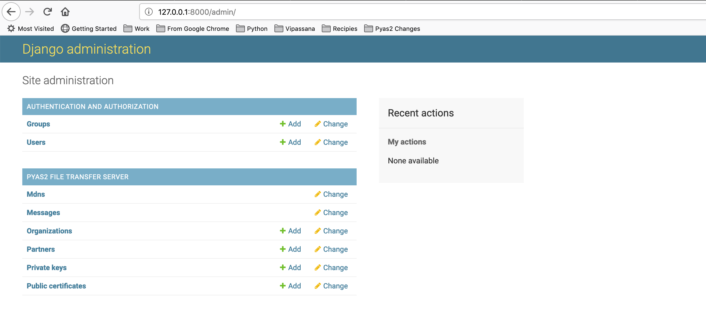
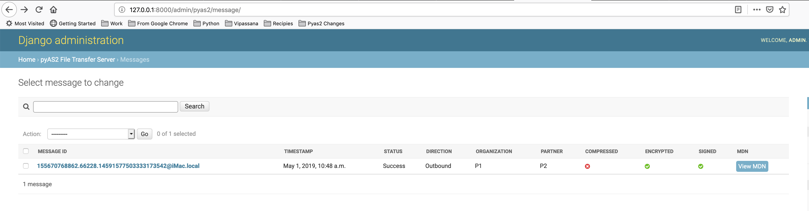
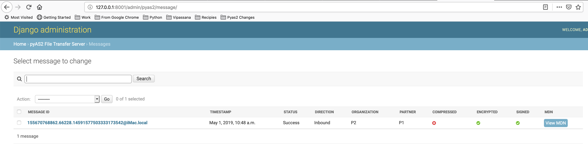

Quickstart
==========

This guide will walk you through the basics of setting up an AS2 server and transferring files using the AS2 protocol. Let's get started by sending a signed and encrypted file from one pyAS2 server ``P1`` to another pyAS2 server ``P2``. Do note that these two are separate installations of pyAS2.

Installing the Servers
----------------------
Create a Django project called ``P1`` and follow the :doc:`installation guide <installation>`
and run ``python manage.py runserver`` to start ``P1`` at http://127.0.0.1:8000/admin/

Create one more Django project called ``P2`` and follow the same installations instructions,
and run ``python manage.py runserver 127.0.0.1:8001`` to start ``P2`` at http://127.0.0.1:8001/admin/

Creating the certificates
-------------------------
We need to generate a Public and Private key pair each for the two servers. ``P1`` uses its private key
to sign the message which is verified by ``P2`` using ``P1's`` public key. ``P1`` uses the ``P2's`` public key
to encrypt the message which is decrypted by ``P2`` using its private key.

To generate the public and private key pair use the below commands

.. code-block:: console

    $ openssl req -x509 -newkey rsa:2048 -sha256 -keyout P1_private.pem -out P1_public.pem -days 365
    Generating a 2048 bit RSA private key
    .....+++
    ................................................................................................+++
    writing new private key to 'P1_private.pem'
    Enter PEM pass phrase:
    Verifying - Enter PEM pass phrase:
    -----
    You are about to be asked to enter information that will be incorporated
    into your certificate request.
    What you are about to enter is what is called a Distinguished Name or a DN.
    There are quite a few fields but you can leave some blank
    For some fields there will be a default value,
    If you enter '.', the field will be left blank.
    -----
    Country Name (2 letter code) [AU]:IN
    State or Province Name (full name) [Some-State]:Karnataka
    Locality Name (eg, city) []:Bangalore
    Organization Name (eg, company) [Internet Widgits Pty Ltd]:P1
    Organizational Unit Name (eg, section) []:AS2
    Common Name (e.g. server FQDN or YOUR name) []:p1as2
    Email Address []:
    $ cat P1_public.pem >> P1_private.pem

    $ openssl req -x509 -newkey rsa:2048 -sha256 -keyout P2_private.pem -out P2_public.pem -days 365
    Generating a 2048 bit RSA private key
    ..............................+++
    ............................................................................................................+++
    writing new private key to 'P2_private.pem'
    Enter PEM pass phrase:
    Verifying - Enter PEM pass phrase:
    -----
    You are about to be asked to enter information that will be incorporated
    into your certificate request.
    What you are about to enter is what is called a Distinguished Name or a DN.
    There are quite a few fields but you can leave some blank
    For some fields there will be a default value,
    If you enter '.', the field will be left blank.
    -----
    Country Name (2 letter code) [AU]:IN
    State or Province Name (full name) [Some-State]:Karnataka
    Locality Name (eg, city) []:Bangalore
    Organization Name (eg, company) [Internet Widgits Pty Ltd]:P2
    Organizational Unit Name (eg, section) []:AS2
    Common Name (e.g. server FQDN or YOUR name) []:p2as2
    Email Address []:
    $ cat P2_public.pem >> P2_private.pem

Configure P1
------------
``P1`` needs to be configured before it can start sending files, open the web UI and follow these instructions:

* Navigate to ``Private Keys->Add private key``.
* Choose the file ``P1_private.pem`` in the `key file` field, enter the passphrase and save the Private Certificate.
* Next navigate to ``Public Certificates->Add public certificate``.
* Choose the file ``P2_public.pem`` in the `certificate file` field and save the Public Certificate.
* Now navigate to ``Organization->Add organization``.
* Set Name to ``P1``, As2 Name to ``p1as2`` and set the Signature and Encryption keys to ``P1_private.pem`` and save the Organization.
* Next navigate to ``Partner->Add partner``.
* Set Name to ``P2``, As2 Name to ``p2as2`` and Target url to ``http://127.0.0.1:8001/pyas2/as2receive``
* Under security settings set Encrypt Message to ``3DES``, Sign Message to ``SHA-256``, Signature and Encryption keys to ``P2_public.pem``.
* Under MDN settings set MDN mode to ``Synchronous`` and Request Signed MDN to ``SHA-256``.
* Save the partner to complete the configuration.

Configure P2
------------
``P2`` needs to be configured before it can start receiving files, open the web UI and follow these instructions:

* Navigate to ``Private Certificates->Add private key``.
* Choose the file ``P2_private.pem`` in the `key file` field, enter the passphrase and save the Private Certificate.
* Next navigate to ``ublic Certificates->Add public certifcate``.
* Choose the file ``P1_public.pem`` in the `certificate file` field and save the Public Certificate.
* Now navigate to ``Organization->Add organization``.
* Set Name to ``P2``, As2 Name to ``p2as2`` and set the Signature and Encryption keys to ``P2_private.pem`` and save the Organization.
* Next navigate to ``Partner->Add partner``.
* Set Name to ``P1``, As2 Name to ``p1as2`` and Target url to ``http://127.0.0.1:8000/pyas2/as2receive``
* Under security settings set Encrypt Message to ``3DES``, Sign Message to ``SHA-256``, Signature and Encryption keys to ``P1_public.pem``.
* Under MDN settings set MDN mode to ``Synchronous`` and Request Signed MDN to ``SHA-256``.
* Save the partner to complete the configuration.

Send a File
-----------
We are now read to send a file from ``P1`` to ``P2``, to do so follow these steps:

* Open the ``P1`` web UI and navigate to `Partners``.
* Select the partner `P2` and action `Send a message to selected partner` and click Go.
* Select the Organization as ``P1`` and Partner as ``P2``.
* Now select the file to send and click ``Send Message``.
* The status of the file transfer can be viewed by navigating to ``Messages``.
* Once file transfer is completed you will a green tick in the status column.

* We will also see a similar entry in the web UI of ``P2``.

* We can see basic information on this screen such as Partner, Organization, Message ID and MDN.
* We can also view the MDN and Payload by clicking on the respective links.

Conclusion
----------
We have successfully demonstrated the core functionality of ``django-pyas2`` i.e. sending files from one system to another using
the AS2 protocol. For a more detailed overview of all its functionality do go through the :doc:`detailed docs<detailed-guide/index>`.
